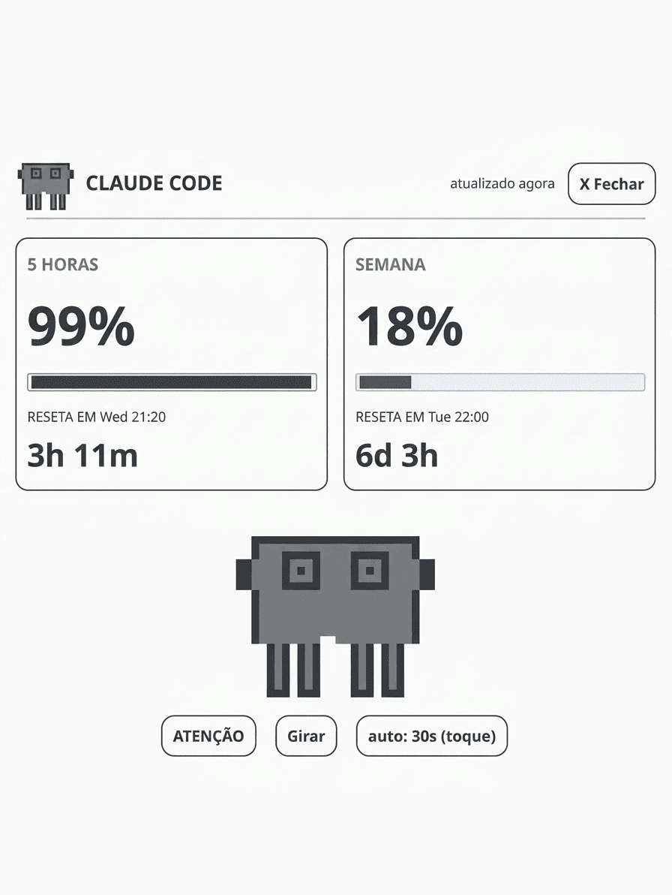

# Claude Usage Reader — standalone Kindle app (KUAL)

A **standalone app for jailbroken Kindles** that shows your **Claude Code rate-limit usage** in real
time. It launches from **KUAL** as its own entry — KOReader does not need to be installed and never
runs. No computer, no cloud: the app queries Anthropic's API directly from the e-reader, reads usage
straight from the response headers, and renders it on a fullscreen dashboard — with the **Clawd**
pixel-art mascot, progress bars, reset countdowns and auto-refresh.

It ships a trimmed copy of the KOReader runtime (LuaJIT, TLS, e-ink widgets, fonts) inside the
package, which is what makes a self-contained HTTPS-capable e-ink app possible.
Previous versions were a KOReader plugin; that form is retired.

Inspired by [claude-usage-stick-SVGL](https://github.com/benevid/claude-usage-stick-SVGL) (the
ESP32 desk gadget).

---

## How it works

The app makes a **minimal** `POST` (`max_tokens: 1`) to
`https://api.anthropic.com/v1/messages` and **doesn't use the response body** — it reads usage
straight from the headers:

```
anthropic-ratelimit-unified-status           allowed | allowed_warning | rejected
anthropic-ratelimit-unified-5h-utilization   0–1   (5-hour session window)
anthropic-ratelimit-unified-7d-utilization   0–1   (7-day weekly window)
anthropic-ratelimit-unified-5h-reset         epoch (when the 5h window resets)
anthropic-ratelimit-unified-7d-reset         epoch (when the 7d window resets)
```

That single request costs ~1 token per refresh cycle.

### How the token works

The app authenticates with a **Claude Code OAuth token** (`sk-ant-oat01-…`) — the same kind
generated by `claude setup-token`. A raw API call with this token is usually **rejected**, so the
app sends exactly the headers Claude Code sends:

- `Authorization: Bearer sk-ant-oat01-…`
- `anthropic-beta: oauth-2025-04-20`
- `User-Agent: claude-code/2.1.5`

The API then responds **200** and returns the rate-limit headers. Since the body is discarded and
it's just 1 token, **quota consumption is negligible**.

> **Key constraint:** the API returns utilization **percentages only** for subscription accounts —
> never raw token counts. The real numbers live in local Claude Code transcripts
> (`~/.claude/projects/**/*.jsonl`), not on the Kindle.

---

## Dashboard

<p align="center">
  
</p>

The fullscreen dashboard (grayscale — Kindle e-ink has no color) shows:

- **Two usage cards** — session (5h) and weekly (7d), each with a large percentage, a
  `ProgressWidget` bar, the reset date, and a live countdown.
- **Clawd mascot** — the Claude Code pixel-art mascot with usage-driven resting faces:
  `love` (< 50 %), `neutral` (50–75 %), `strain` (75–90 %), `dizzy` (≥ 90 % or rejected).
  Random occasional animations: `blink`, `shy`, `heart`, `sparkle`.
- **Status pill** — `OK` / `WARNING` / `LIMITED` depending on the API response.
- **Auto-refresh** — configurable interval (Off / 10 / 30 / 60 / 300 s), tappable label to cycle.
- **Rotation** — the circular-arrow button turns the screen 90° per tap, through all four
  orientations (the Kindle has no rotation sensor). The choice is remembered.
- **Auto-login** — if the token expires while the dashboard is open, the QR login modal pops
  automatically.

---

## First-time setup

### 1. Get a token

On any PC with **Claude Code** installed and logged into your subscription (Pro or Max):

```bash
claude setup-token
```

This opens an OAuth flow in the browser. You'll receive a long-lived token in the form
`sk-ant-oat01-…`. Copy it.

### 2. Install the app

**If your jailbreak was Springbreak or Winterbreak**, use **KPM** — type in the Kindle search bar:

```
;kpm add-repo <repo-url>
;kpm install claudeusage
```

(The package isn't in the official KMC repo; `add-repo` points KPM at this project's own repo —
see *Publishing* below. Once installed it appears in KUAL, or runs via `kpm launch claudeusage`.)

**Otherwise (plain KUAL install):** grab the zip for your Kindle from the
[Releases](https://github.com/juanvieiraprado99/claude-usage-reader/releases) page
and unzip it into the extensions folder:

| File | Kindle |
| --- | --- |
| `claudeusage-<ver>-kindlepw2.zip` | Paperwhite 2/3, Voyage, Oasis 1, basic 7th/8th gen |
| `claudeusage-<ver>-kindlehf.zip` | modern models (PW4/PW5, Oasis 3, Scribe, basic 10th/11th gen) |

```
/mnt/us/extensions/claudeusage/
```

Reopen KUAL — **Claude Usage** appears in the menu.

Wrong build? `crash.log` says `./luajit: not found`. That is the **ELF
interpreter** missing, not the file — download the other one.

Either way, app data lives in `/mnt/us/claudeusage/` — outside the install directory, so a
`kpm upgrade` or a reinstall never wipes your token. If you used the old KOReader plugin, your
encrypted token and usage history are **imported** automatically from `koreader/settings/`.

Releases are built automatically: every push to `main` runs
`.github/workflows/release.yml`, which boots the app headless as a smoke test and
then publishes `v0.1.<run>` with both platforms' `.zip` and `.kpkg`.

To build the artifacts yourself:

```bash
./packaging/fetch-runtime.sh '' kindlepw2   # runtime for your platform
./packaging/build.sh                        # -> dist/*.zip (KUAL) + dist/*.kpkg (KPM)
```

The KOReader release the runtime comes from is pinned in
`packaging/KOREADER_VERSION`; the app's own version lives in `VERSION` (CI
appends the run number). Platform names follow KPM's: `kindlepw2`, `kindlehf`,
`kindle5`, `kindle`. Check with `uname -m` on the device.

#### Publishing a KPM repo

Fork [kpm-repository-template](https://github.com/KindleModding/kpm-repository-template), then:

```bash
python3 packaging/.kpm-helper.py repo add <repo-checkout> dist/claudeusage_<ver>_<platform>.kpkg
```

Commit and push — the template's GitHub Pages workflow builds the index. The Pages URL is what
users pass to `;kpm add-repo`.

### 3. Login via QR code

1. Launch **Claude Usage** from KUAL. With no token stored it opens the login screen directly
   (later you can reach it by tapping the **version label** in the bottom-right corner →
   **Login (web)**).
2. A modal shows a **QR code**, the URL `http://<ip>:8099/?k=<PIN>`, and the PIN.
3. **Scan the QR** with a phone on the **same WiFi** — the form opens with the PIN pre-filled.
4. Paste the `sk-ant-oat01-…` token and submit.
5. The token is **validated** (a real API probe) before it is stored.

The URL / PIN / QR **rotate every 5 minutes**; a stale QR stops working.

### 4. Set a PIN

After the token is validated, you're asked to **create a 4-digit PIN**. The token is
**encrypted** with it (ChaCha20 + iterated SHA-256) and saved. On later launches the app asks for
that PIN once to unlock (cached in RAM while the app is open).

### 5. Use it

Launching **Claude Usage** from KUAL goes straight to the dashboard after the PIN. Swipe between
the three pages (dashboard, models, 5h trend). Tapping the **version label** in the bottom-right
corner opens the settings dialog: **language** (Português / English), refresh interval,
**Logout** and **Quit app**.

The interface follows your system language, defaulting to Portuguese, and the choice you
make in the dialog is remembered.

- **Logout (clear token)** wipes the stored token (e.g. before lending the device).
- There is **no bundled token** — each user logs in with their own account.

---

## Security

| Layer                    | Detail                                                                                                                                                                                                                                                                                                                                                                                       |
| ------------------------ | -------------------------------------------------------------------------------------------------------------------------------------------------------------------------------------------------------------------------------------------------------------------------------------------------------------------------------------------------------------------------------------------- |
| **At rest**              | Token stored **encrypted** (ChaCha20 stream cipher). Key derived from your PIN via iterated SHA-256 (1 500 rounds). PIN is never stored. A verifier detects wrong PINs. After **8 wrong attempts** the token is wiped. The crypto modules self-test against RFC 8439 / FIPS-180 vectors at load — if the self-test fails the plugin **refuses to store** rather than fall back to plaintext. |
| **In transit**           | Web login is plaintext **HTTP on your LAN** (no TLS on e-ink). The PIN gates the submit and the server is transient. **Use a trusted WiFi** for login.                                                                                                                                                                                                                                       |
| **Confidentiality-only** | No MAC — tampering corrupts the blob but cannot reveal the token.                                                                                                                                                                                                                                                                                                                            |
| **Honest limit**         | A 4-digit PIN is only 10,000 combinations. The KDF slows guessing and the lockout stops on-device tries, but **someone who copies the settings file can brute-force 4 digits offline**. Encryption defeats casual file reading and anyone without the PIN — not a determined attacker with the file. **If the device is lost, revoke the token at console.anthropic.com.**                   |

---

## Repository layout

```
app/
  app.lua            Entry point — boots the runtime, runs the UIManager loop
  controller.lua     App controller — fetch, PIN prompt, pages, settings, token lifecycle
  screenbase.lua     Shared page: frame, header, nav, gestures, refresh scheduling
  theme.lua          Grayscale palette and metrics
  fmt.lua            Header/epoch formatting helpers
  usagescreen.lua    Fullscreen dashboard — cards, mascot, auto-refresh, gestures
  modelsscreen.lua   Per-model probe page (latency + status)
  trendscreen.lua    5h-window trend page
  chart.lua          Trend chart drawn into a Blitbuffer
  history.lua        Rolling 5h-utilization samples on disk
  clawd.lua          Clawd mascot as Lua pixel-art (28×24 grid, procedural geometry)
  roticon.lua        Rotate arrow, drawn into a Blitbuffer
  appversion.lua     Version string, replaced by the build
  crypto.lua         Token encryption at rest (ChaCha20 + iterated SHA-256 KDF)
  sha256.lua         SHA-256 implementation for LuaJIT (self-tested vs FIPS vectors)
  chacha20.lua       ChaCha20 stream cipher for LuaJIT (self-tested vs RFC 8439 vectors)
  tokenserver.lua    Transient LAN HTTP receiver for the token form (luasocket)
  loginmodal.lua     QR code modal — owns TokenServer, rotates PIN/URL/QR every 5 min
  i18n.lua           Portuguese/English strings (English msgids)
extensions/claudeusage/
  config.xml         Extension manifest — without it KUAL ignores the folder
  menu.json          KUAL menu entry
  bin/claudeusage.sh Launcher — framework handling, env, settings import
packaging/
  fetch-runtime.sh   Downloads the KOReader release used as the runtime
  prune.txt          What gets stripped from that runtime
  build.sh           Prunes + assembles the KUAL zip and the KPM .kpkg
  run-emulator.sh    Runs the app on a KOReader emulator build (dev loop)
  kpkg/              KPM manifest template + install/launch/uninstall hooks
```

`runtime/` is not versioned — it is fetched on demand and only ships inside release zips.

---

## Where to tweak

| What                              | Where                                                     |
| --------------------------------- | --------------------------------------------------------- |
| API endpoint, probe model         | `controller.lua` — `ENDPOINT` and `PROBE_MODEL` constants |
| Dashboard layout, card sizing     | `usagescreen.lua` — `rebuild()`, `makeCard()`             |
| Mascot emotions, animation timing | `clawd.lua` — `emotionFor()`, `Clawd.ANIMS`               |
| Encryption KDF iterations         | `crypto.lua` — `DEFAULT_ITERS` (1 500)                    |
| Max wrong PIN attempts            | `controller.lua` — `MAX_FAILS` (8)                        |
| Bundled runtime version           | `packaging/fetch-runtime.sh` — `VERSION`, `PLATFORM`      |
| QR rotation interval              | `loginmodal.lua` — `ROTATE_EVERY` (300 s)                 |
| Auto-refresh intervals            | `controller.lua` — `INTERVAL_CYCLE` ({0, 10, 30, 60, 300}) |
| Colors and spacing                | `theme.lua`                                               |

---

## Credits and licence

Concept and header-parsing technique derived from the
[Claude Usage Stick](https://github.com/benevid/claude-usage-stick-SVGL) project. This is a
standalone KUAL app (Lua/LuaJIT) for jailbroken Kindles — not an official Anthropic product.

The app bundles and redistributes a trimmed [KOReader](https://github.com/koreader/koreader)
runtime (LuaJIT, the e-ink widget frontend, luasec/luasocket, fonts), which is licensed under
**AGPL-3.0**. This project is therefore also released under **AGPL-3.0** — see `LICENSE`.
