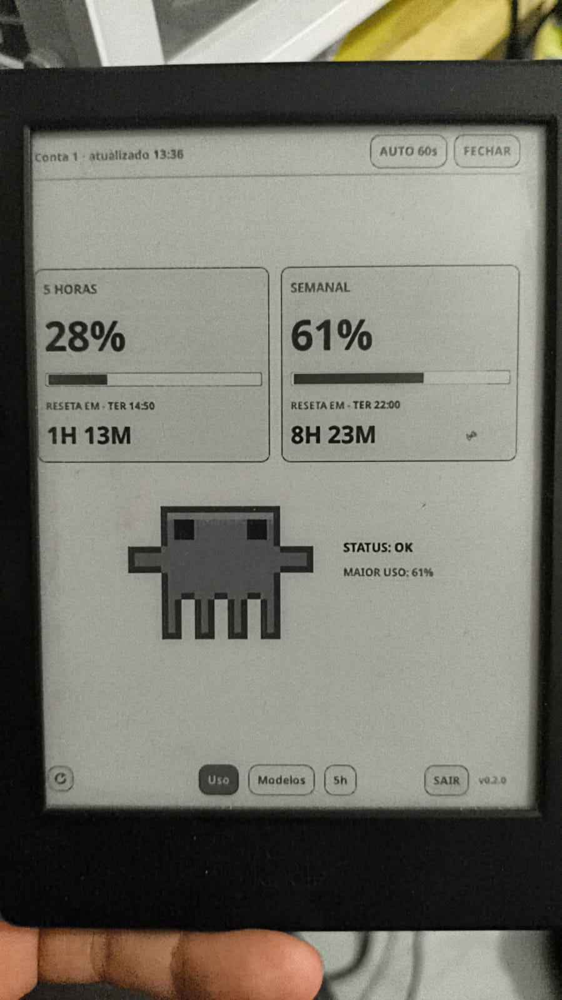
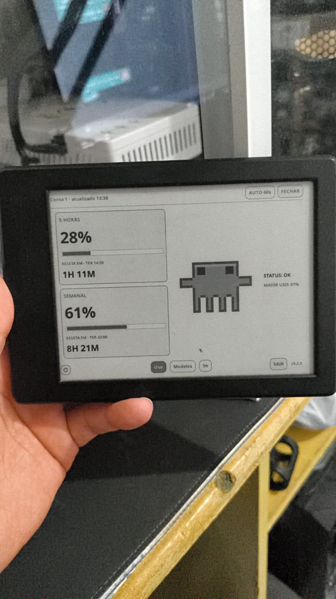
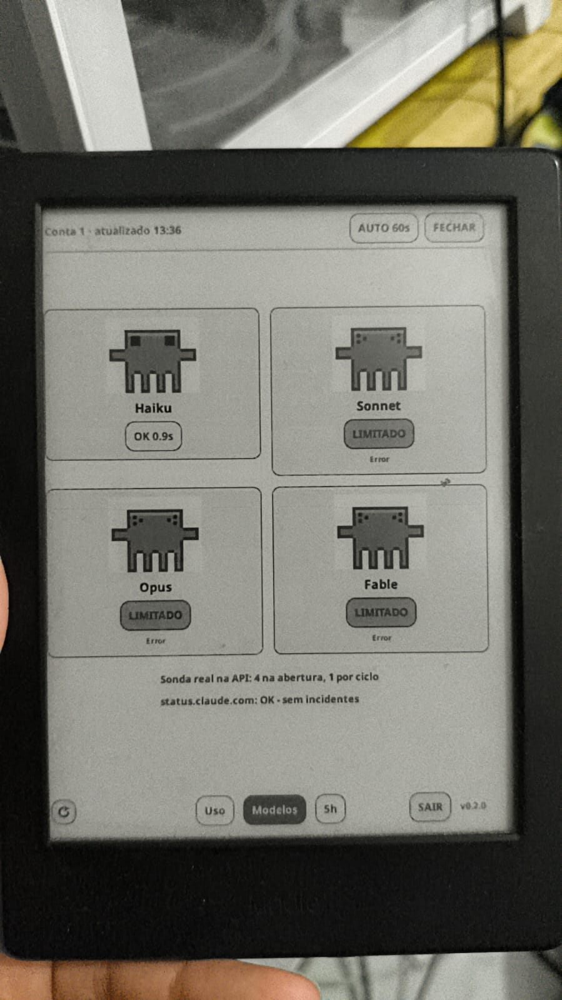
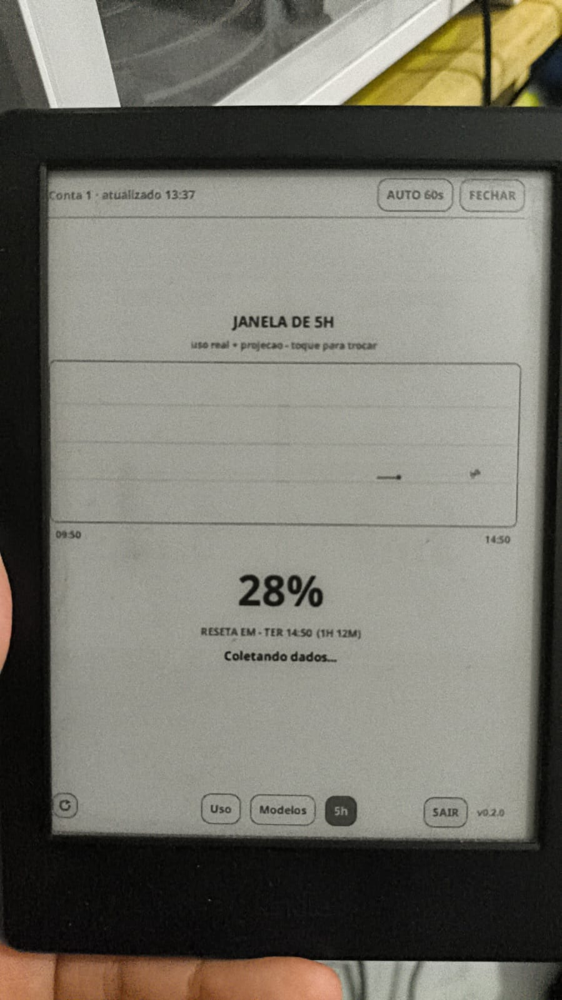
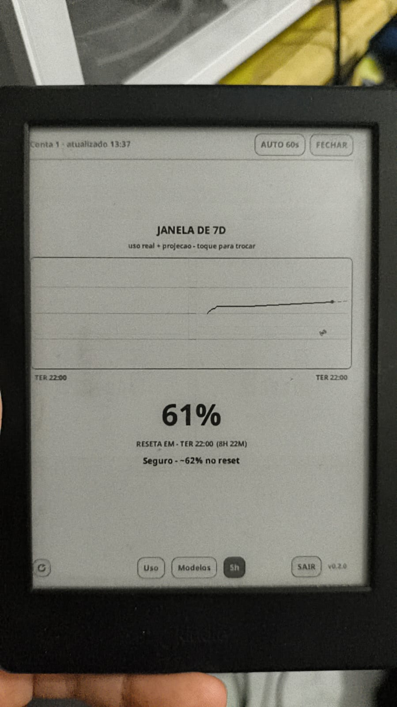
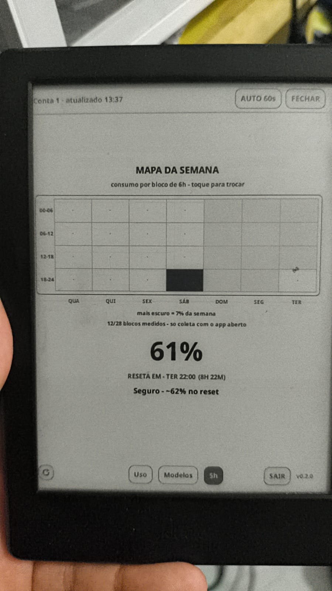
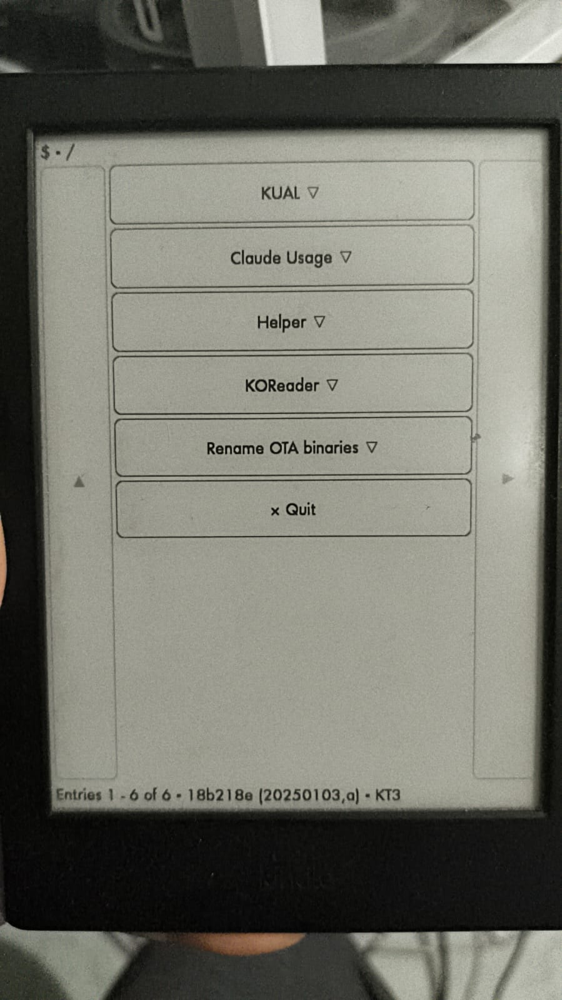
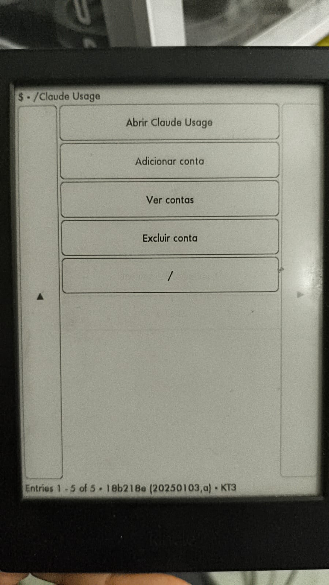
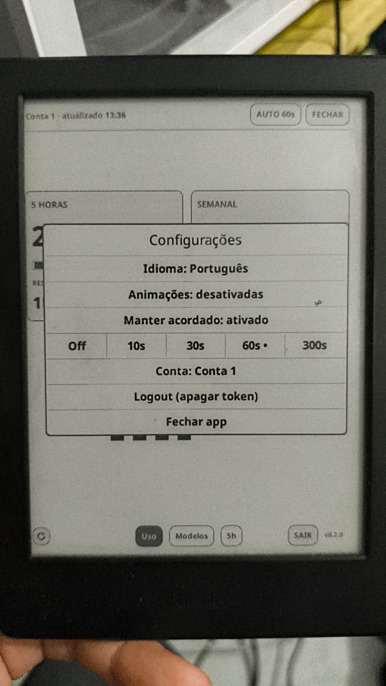

# Claude Usage Reader — standalone Kindle app (KUAL)

<details>
<summary><b>🇧🇷 Leia em Português (clique para expandir)</b></summary>

Um **app independente para Kindles com jailbreak** que mostra o **uso dos limites
do Claude Code** em tempo real. Ele abre pelo **KUAL** como uma entrada própria —
o KOReader não precisa estar instalado e nunca é executado. Sem PC, sem nuvem: o
app consulta a API da Anthropic direto do e-reader, lê o uso nos cabeçalhos da
resposta e desenha tudo num painel em tela cheia — com o mascote pixel-art
**Clawd**, barras de progresso, contagem regressiva até o reset e atualização
automática.

O pacote embute uma cópia enxuta do runtime do KOReader (LuaJIT, TLS, widgets de
e-ink, fontes), que é o que torna possível um app e-ink autossuficiente capaz de
falar HTTPS. Versões antigas eram um plugin do KOReader; essa forma foi
aposentada.

Inspirado no [claude-usage-stick-SVGL](https://github.com/benevid/claude-usage-stick-SVGL)
(o gadget de mesa com ESP32).

**Índice**

- [Como funciona](#como-funciona) · [o token](#como-o-token-funciona)
- [As telas](#as-telas) — [painel](#página-1--painel) · [modelos](#página-2--modelos) · [tendência](#página-3--tendência) · [em todas](#em-todas-as-páginas)
- [Configuração inicial](#configuração-inicial)
  1. [Obter um token](#1-obter-um-token)
  2. [Instalar o app](#2-instalar-o-app) · [publicar um repo KPM](#publicando-um-repositório-kpm)
  3. [Login pelo QR code](#3-login-pelo-qr-code)
  4. [Definir um PIN](#4-definir-um-pin)
  5. [Usar](#5-usar)
  6. [Várias contas](#6-várias-contas)
- [Segurança](#segurança)
- [Estrutura do repositório](#estrutura-do-repositório)
- [Onde ajustar](#onde-ajustar)
- [Créditos e licença](#créditos-e-licença)

---

### Como funciona

O app faz um `POST` **mínimo** (`max_tokens: 1`) para
`https://api.anthropic.com/v1/messages` e **descarta o corpo da resposta** — os
dados vêm dos cabeçalhos:

```
anthropic-ratelimit-unified-status           allowed | allowed_warning | rejected
anthropic-ratelimit-unified-5h-utilization   0–1   (janela de sessão, 5 horas)
anthropic-ratelimit-unified-7d-utilization   0–1   (janela semanal, 7 dias)
anthropic-ratelimit-unified-5h-reset         epoch (quando a janela de 5h reseta)
anthropic-ratelimit-unified-7d-reset         epoch (quando a janela de 7d reseta)
```

Essa única requisição custa ~1 token por ciclo de atualização.

#### Como o token funciona

O app se autentica com um **token OAuth do Claude Code** (`sk-ant-oat01-…`) — o
mesmo gerado por `claude setup-token`. Uma chamada crua à API com esse token
normalmente é **rejeitada**, então o app envia exatamente os cabeçalhos que o
Claude Code envia:

- `Authorization: Bearer sk-ant-oat01-…`
- `anthropic-beta: oauth-2025-04-20`
- `User-Agent: claude-code/2.1.5`

Aí a API responde **200** e devolve os cabeçalhos de rate limit. Como o corpo é
descartado e é só 1 token, **o consumo de cota é desprezível**.

> **Limite importante:** para contas de assinatura a API devolve **apenas
> porcentagens** de utilização — nunca contagem de tokens. Os números reais estão
> nos transcripts locais do Claude Code (`~/.claude/projects/**/*.jsonl`), não no
> Kindle.

---

### As telas

<p align="center">
  
</p>

São três páginas, trocadas por deslize (swipe) ou tocando nas abas da barra
inferior — **Uso / Modelos / 5h**. Tudo em escala de cinza: e-ink de Kindle não
tem cor.

> As fotos abaixo são do app rodando num Kindle de verdade, com a interface no
> Português padrão.

#### Página 1 — painel

- **Dois cartões de uso** — sessão (5h) e semana (7d), cada um com a porcentagem
  em tamanho grande, uma barra de progresso, a data do reset e uma contagem
  regressiva ao vivo.
- **Mascote Clawd** — o pixel-art do Claude Code, com expressões conforme o uso:
  `love` (< 50 %), `neutral` (50–75 %), `strain` (75–90 %), `dizzy` (≥ 90 % ou
  rejeitado). Animações aleatórias e ocasionais: `blink`, `shy`, `heart`,
  `sparkle` (dá para desligar nas configurações).
- **Selo de status** — `OK` / `WARNING` / `LIMITED`, conforme a resposta da API.

<p align="center">
  <br>
  <sub>a mesma página em paisagem — o layout se refaz a cada rotação</sub>
</p>

#### Página 2 — modelos

Grade 2×2 (retrato) ou uma linha (paisagem) com Haiku, Sonnet, Opus e Fable. Cada
um mostra um humor do Clawd e um chip de status com a latência. A saúde vem de
duas fontes: um probe real (os quatro na primeira abertura, depois um modelo por
ciclo, em rodízio) e os incidentes publicados em status.claude.com.

<p align="center">
  
</p>

#### Página 3 — tendência

Gráfico da série histórica mais uma linha de veredito com a **projeção de
consumo** (inclinação de dois pontos → ETA até 100 %, comparada com o reset da
janela). Tocar no gráfico alterna entre três modos: **5h → 7d → mapa de calor**.

<table>
  <tr>
    <td></td>
    <td></td>
    <td></td>
  </tr>
  <tr>
    <td align="center"><sub>5h</sub></td>
    <td align="center"><sub>7d</sub></td>
    <td align="center"><sub>mapa da semana</sub></td>
  </tr>
</table>

O mapa de calor é a semana numa grade de 7 colunas (dias) × 4 linhas (blocos de
6h), com a célula mais escura onde mais cota foi consumida. Leia os avisos que a
própria tela imprime: o valor guardado é utilização **acumulada**, então cada
célula é um **delta derivado**, espalhado pelo intervalo entre duas amostras — não
uma observação direta; o sombreado é **relativo ao bloco mais cheio daquela
semana**; e blocos sem medição são desenhados de forma diferente de blocos
zerados, porque "ocioso" e "app fechado" não podem parecer a mesma coisa. A
resolução é 7×4 e não 7×24 por causa da **taxa de amostragem**, não do layout: só
há amostra enquanto o app está aberto, no máximo uma por hora.

#### Em todas as páginas

- **Cabeçalho** — `conta · 14:03 · 87%`: o nome da conta (só quando há mais de
  uma), a hora da última atualização e a bateria. Cada parte some quando não se
  aplica.
- **Atualização automática** — intervalo configurável (Off / 10 / 30 / 60 / 300 s),
  com recuo exponencial depois de falhas (o rádio é que gasta bateria, não a CPU).
- **Rotação** — o botão de seta circular gira a tela 90° por toque, passando pelas
  quatro orientações (o Kindle não tem sensor de rotação). A escolha é lembrada.
- **Barra inferior** — seta de rotação, abas de navegação, o botão **LOGOUT**
  (só quando há token) e o rótulo de versão, que abre as configurações.
- **Anti-ghosting** — a cada 6 repaints o app promove um refresh completo com
  flash, para o texto fantasma não se acumular no painel.
- **Re-login automático** — se o token expirar com o painel aberto (401/403), o
  modal de login com QR aparece sozinho, e o token renovado volta para a **mesma
  conta**.

---

### Configuração inicial

#### 1. Obter um token

Em qualquer PC com o **Claude Code** instalado e logado na sua assinatura (Pro ou
Max):

```bash
claude setup-token
```

Isso abre um fluxo OAuth no navegador. Você recebe um token de longa duração no
formato `sk-ant-oat01-…`. Copie.

#### 2. Instalar o app

**Se o seu jailbreak foi Springbreak ou Winterbreak**, use o **KPM** — digite na
barra de busca do Kindle:

```
;kpm add-repo <url-do-repo>
;kpm install claudeusage
```

(O pacote não está no repositório oficial do KMC; o `add-repo` aponta o KPM para o
repositório deste projeto — veja [Publicando](#publicando-um-repositório-kpm)
abaixo. Instalado, ele aparece no
KUAL, ou roda via `kpm launch claudeusage`.)

**Caso contrário (instalação KUAL comum):** baixe o zip do seu Kindle na página de
[Releases](https://github.com/juanvieiraprado99/claude-usage-reader/releases) e
descompacte na pasta de extensões:

| Arquivo | Kindle |
| --- | --- |
| `claudeusage-<ver>-kindlepw2.zip` | Paperwhite 2/3, Voyage, Oasis 1, básico 7ª/8ª geração |
| `claudeusage-<ver>-kindlehf.zip` | modelos atuais (PW4/PW5, Oasis 3, Scribe, básico 10ª/11ª geração) |

```
/mnt/us/extensions/claudeusage/
```

Reabra o KUAL — **Claude Usage** aparece no menu, como um submenu: abrir,
adicionar conta, ver contas, excluir conta.

<table>
  <tr>
    <td></td>
    <td></td>
  </tr>
</table>

Build errado? O `crash.log` diz `./luajit: not found`. Isso é o **interpretador
ELF** que falta, não o arquivo — baixe o outro.

De qualquer forma, os dados do app ficam em `/mnt/us/claudeusage/` — fora da pasta
de instalação, então um `kpm upgrade` ou uma reinstalação nunca apaga seu token.
(Se criar esse diretório falhar, o launcher cai para
`extensions/claudeusage/settings/`.) Se você usava o antigo plugin do KOReader,
seu token criptografado e o histórico são **importados** automaticamente de
`koreader/settings/`.

Os releases são automáticos: todo push na `main` roda
`.github/workflows/release.yml`, que dá boot no app em modo headless como teste de
fumaça (esse job é o portão de verdade — ele abre as três páginas, força um
repaint em cada e cicla a rotação) e depois publica a tag `v<VERSION>` com o
`.zip` e o `.kpkg` das duas plataformas. Se o `VERSION` não mudou, a tag já existe
e a publicação é **pulada** com um aviso — a `main` não fica vermelha por isso.

Para gerar os artefatos você mesmo:

```bash
./packaging/fetch-runtime.sh '' kindlepw2   # runtime da sua plataforma
./packaging/build.sh                        # -> dist/*.zip (KUAL) + dist/*.kpkg (KPM)
```

No Windows use `./packaging/build-docker.sh` (sem argumentos): o mesmo script num
container, porque o `build.sh` precisa de `zip` e de um `python3` de verdade. Para
testar sem Kindle nenhum, `./packaging/run-docker.sh [--pruned]` dá boot no app em
modo headless.

A release do KOReader usada como runtime está fixada em
`packaging/KOREADER_VERSION`; a versão do app fica em `VERSION`, no formato
`major.minor.patch` — é a única fonte, nada é derivado dela, e o `build.sh`
recusa qualquer outro formato. Bump no mesmo commit da mudança que você quer
lançar. Os nomes de plataforma seguem os do KPM: `kindlepw2`, `kindlehf`,
`kindle5`, `kindle`. Confira com `uname -m` no aparelho.

##### Publicando um repositório KPM

Faça um fork do
[kpm-repository-template](https://github.com/KindleModding/kpm-repository-template)
e depois:

```bash
python3 packaging/.kpm-helper.py repo add <checkout-do-repo> dist/claudeusage_<ver>_<plataforma>.kpkg
```

(O `.kpm-helper.py` não é versionado aqui — o `build.sh` baixa ele do repositório
KindleModding/KPM quando precisa, então esse comando só funciona depois de um
build.)

Commit e push — o workflow de GitHub Pages do template monta o índice. A URL do
Pages é o que os usuários passam para o `;kpm add-repo`.

#### 3. Login pelo QR code

1. Abra o **Claude Usage** pelo KUAL. Sem token guardado, ele já cai na tela de
   login (depois, dá para chegar lá tocando no **rótulo de versão** no canto
   inferior direito → **Login (web)**).
2. Um modal mostra um **QR code**, a URL `http://<ip>:8099/?k=<PIN>` e o PIN.
3. **Escaneie o QR** com um celular na **mesma rede WiFi** — o formulário abre com
   o PIN já preenchido.
4. Cole o token `sk-ant-oat01-…` e envie.
5. O token é **validado** (um probe real na API) antes de ser guardado.

A URL / PIN / QR **giram a cada 5 minutos**; um QR velho para de funcionar.

#### 4. Definir um PIN

Depois que o token é validado, o app pede para você **criar um PIN de 4 dígitos**.
O token é **criptografado** com ele (ChaCha20 + SHA-256 iterado) e salvo. Nas
próximas aberturas o app pede esse PIN uma vez para destravar (fica em RAM
enquanto o app está aberto).

#### 5. Usar

Abrir o **Claude Usage** pelo KUAL vai direto para o painel, depois do PIN.
Deslize entre as três páginas. Tocar no **rótulo de versão** no canto inferior
direito abre as configurações:

- **Idioma** (Português / English)
- **Animações** on/off
- **Manter acordado** on/off — quando ligado (padrão), o Kindle não hiberna
  enquanto o app estiver na tela. É o principal motivo de a bateria cair rápido;
  desligue se preferir economia à atualização contínua.
- **Intervalo** de atualização automática
- **Conta** — abre a lista de contas (quando há uma ativa)
- **Login (web)** / **Logout (limpar token)**
- **Sair do app**

<p align="center">
  
</p>

A interface segue o idioma do sistema, com Português como padrão, e a escolha
feita no diálogo é lembrada.

O **logout** também tem um botão visível na barra inferior, com confirmação. Ele
não deixa você na mão: se houver outra conta guardada, o app troca para ela em vez
de voltar ao modal de login. E **não existe token embutido** — cada pessoa entra
com a própria conta.

#### 6. Várias contas

O app guarda até **5 contas**. Cada uma tem o próprio token criptografado, o
próprio PIN, o próprio contador de tentativas erradas e o **próprio arquivo de
histórico** — as janelas de rate limit são de contas diferentes, então um
histórico compartilhado transformaria a troca de conta numa curva falsa de
consumo.

A entrada do KUAL é um submenu com quatro itens: abrir, adicionar conta, ver
contas, excluir conta. Os três últimos são atalhos que abrem direto o diálogo
correspondente. A mesma lista é acessível pela linha **Conta** nas configurações;
a conta ativa aparece marcada com `•`.

Excluir uma conta remove o registro mas **mantém o arquivo de histórico em disco**
— sair de uma conta não pode destruir dias de amostras em silêncio.

---

### Segurança

| Camada | Detalhe |
| --- | --- |
| **Em repouso** | Token guardado **criptografado** (cifra de fluxo ChaCha20). Chave derivada do seu PIN por SHA-256 iterado (1 500 rodadas). O PIN nunca é armazenado. Um verificador detecta PIN errado. Depois de **8 tentativas erradas** o token daquela conta é apagado. Os módulos de cripto se autotestam contra vetores RFC 8439 / FIPS-180 no load — se o autoteste falha, o app **se recusa a guardar**, em vez de cair para texto puro. |
| **Em trânsito** | O login web é **HTTP em texto puro na sua LAN** (não há TLS no e-ink). O PIN protege o envio e o servidor é transitório. **Use um WiFi confiável** para o login. |
| **Só confidencialidade** | Não há MAC — adulterar corrompe o blob, mas não revela o token. |
| **Limite honesto** | Um PIN de 4 dígitos são só 10 000 combinações. O KDF deixa a adivinhação lenta e o bloqueio impede tentativas no aparelho, mas **quem copiar o arquivo de settings consegue quebrar 4 dígitos offline**. A criptografia derrota leitura casual do arquivo e qualquer um sem o PIN — não um atacante determinado com o arquivo na mão. **Se perder o aparelho, revogue o token em console.anthropic.com.** |

---

### Estrutura do repositório

```
app/
  app.lua            Ponto de entrada — sobe o runtime e roda o loop do UIManager
  controller.lua     Controlador — fetch, PIN, páginas, configurações, contas
  accounts.lua       Lista de contas (máx. 5): blob, PIN e histórico por conta
  screenbase.lua     Página base: moldura, cabeçalho, nav, gestos, agendamento
  theme.lua          Paleta em escala de cinza e métricas
  fmt.lua            Helpers de formatação de cabeçalho/epoch
  usagescreen.lua    Página 1 — cartões, mascote, atualização automática
  modelsscreen.lua   Página 2 — saúde por modelo (latência + status)
  trendscreen.lua    Página 3 — tendência 5h / 7d / mapa de calor
  chart.lua          Gráfico de tendência desenhado num Blitbuffer
  heatmap.lua        A semana como grade 7×4 (um dia por coluna, blocos de 6h)
  burn.lua           Projeção de consumo (inclinação → ETA vs. reset da janela)
  history.lua        Dois ring buffers em disco: 5h a cada fetch, 7d por hora
  battery.lua        Leitura de bateria como texto ("87%" / "87%+" / nada)
  powersave.lua      A chamada única de preventScreenSaver (só Kindle)
  clawd.lua          O mascote Clawd em pixel-art Lua (grade 30×24, procedural)
  roticon.lua        Seta de rotação, desenhada num Blitbuffer
  appversion.lua     String de versão, substituída pelo build
  crypto.lua         Criptografia do token em repouso (ChaCha20 + KDF SHA-256)
  sha256.lua         SHA-256 para LuaJIT (autotestado contra vetores FIPS)
  chacha20.lua       ChaCha20 para LuaJIT (autotestado contra vetores RFC 8439)
  tokenserver.lua    Receptor HTTP transitório na LAN para o formulário (luasocket)
  loginmodal.lua     Modal do QR — dono do TokenServer, gira PIN/URL/QR a cada 5 min
  i18n.lua           Strings Português/Inglês (msgid é o texto em inglês)
extensions/claudeusage/
  config.xml         Manifesto da extensão — sem ele o KUAL ignora a pasta
  menu.json          Submenu do KUAL (abrir / adicionar / ver / excluir conta)
  bin/claudeusage.sh Launcher — framework, env, importação de settings
packaging/
  KOREADER_VERSION   A release do KOReader usada como runtime
  fetch-runtime.sh   Baixa essa release
  prune.txt          O que é removido do runtime
  build.sh           Poda + monta o zip do KUAL e o .kpkg do KPM
  build-docker.sh    O mesmo, num container (hosts sem zip/python3)
  run-docker.sh      Boot headless no Docker [--pruned] (loop de dev)
  run-emulator.sh    Roda no emulador do KOReader (loop de dev)
  smoke.lua          Teste de fumaça: boot, três páginas, repaints, rotação
  kpkg/              Template do manifesto KPM + hooks install/launch/uninstall
```

`runtime/` não é versionado — é baixado sob demanda e só viaja dentro dos zips de
release.

---

### Onde ajustar

| O quê | Onde |
| --- | --- |
| Endpoint da API, modelo do probe | `controller.lua` — `ENDPOINT`, `PROBE_MODEL` (`claude-haiku-4-5-20251001`) |
| Layout do painel, tamanho dos cartões | `usagescreen.lua` — `rebuild()`, `makeCard()` |
| Emoções do mascote, tempo de animação | `clawd.lua` — `emotionFor()`, `Clawd.ANIMS` |
| Iterações do KDF | `crypto.lua` — `DEFAULT_ITERS` (1 500) |
| Máximo de PINs errados | `controller.lua` — `MAX_FAILS` (8) |
| Cadência do refresh completo (ghosting) | `controller.lua` — `FULL_EVERY` (6) |
| Máximo de contas | `accounts.lua` — `MAX_ACCOUNTS` (5) |
| Frequência da amostra semanal | `history.lua` — `MIN_GAP_7D` (3600 s) |
| Sensibilidade da projeção de consumo | `burn.lua` — `Burn.PARAMS` (por janela) |
| Versão do runtime embutido | `packaging/KOREADER_VERSION` |
| Intervalo de rotação do QR | `loginmodal.lua` — `ROTATE_EVERY` (300 s) |
| Intervalos de atualização | `controller.lua` — `INTERVAL_CYCLE` ({0, 10, 30, 60, 300}) |
| Cores e espaçamento | `theme.lua` |

---

### Créditos e licença

Conceito e técnica de leitura dos cabeçalhos derivados do projeto
[Claude Usage Stick](https://github.com/benevid/claude-usage-stick-SVGL). Este é
um app KUAL independente (Lua/LuaJIT) para Kindles com jailbreak — não é um
produto oficial da Anthropic.

O app embute e redistribui um runtime enxuto do
[KOReader](https://github.com/koreader/koreader) (LuaJIT, o frontend de widgets
e-ink, luasec/luasocket, fontes), licenciado sob **AGPL-3.0**. Este projeto é,
portanto, também publicado sob **AGPL-3.0** — veja `LICENSE`.

</details>

A **standalone app for jailbroken Kindles** that shows your **Claude Code rate-limit usage** in real
time. It launches from **KUAL** as its own entry — KOReader does not need to be installed and never
runs. No computer, no cloud: the app queries Anthropic's API directly from the e-reader, reads usage
straight from the response headers, and renders it on a fullscreen dashboard — with the **Clawd**
pixel-art mascot, progress bars, reset countdowns and auto-refresh.

It ships a trimmed copy of the KOReader runtime (LuaJIT, TLS, e-ink widgets, fonts) inside the
package, which is what makes a self-contained HTTPS-capable e-ink app possible.
Previous versions were a KOReader plugin; that form is retired.

Inspired by [claude-usage-stick-SVGL](https://github.com/benevid/claude-usage-stick-SVGL) (the
ESP32 desk gadget).

**Contents**

- [How it works](#how-it-works) · [the token](#how-the-token-works)
- [The screens](#the-screens) — [dashboard](#page-1--dashboard) · [models](#page-2--models) · [trend](#page-3--trend) · [every page](#on-every-page)
- [First-time setup](#first-time-setup)
  1. [Get a token](#1-get-a-token)
  2. [Install the app](#2-install-the-app) · [publishing a KPM repo](#publishing-a-kpm-repo)
  3. [Login via QR code](#3-login-via-qr-code)
  4. [Set a PIN](#4-set-a-pin)
  5. [Use it](#5-use-it)
  6. [Multiple accounts](#6-multiple-accounts)
- [Security](#security)
- [Repository layout](#repository-layout)
- [Where to tweak](#where-to-tweak)
- [Credits and licence](#credits-and-licence)

---

## How it works

The app makes a **minimal** `POST` (`max_tokens: 1`) to
`https://api.anthropic.com/v1/messages` and **doesn't use the response body** — it reads usage
straight from the headers:

```
anthropic-ratelimit-unified-status           allowed | allowed_warning | rejected
anthropic-ratelimit-unified-5h-utilization   0–1   (5-hour session window)
anthropic-ratelimit-unified-7d-utilization   0–1   (7-day weekly window)
anthropic-ratelimit-unified-5h-reset         epoch (when the 5h window resets)
anthropic-ratelimit-unified-7d-reset         epoch (when the 7d window resets)
```

That single request costs ~1 token per refresh cycle.

### How the token works

The app authenticates with a **Claude Code OAuth token** (`sk-ant-oat01-…`) — the same kind
generated by `claude setup-token`. A raw API call with this token is usually **rejected**, so the
app sends exactly the headers Claude Code sends:

- `Authorization: Bearer sk-ant-oat01-…`
- `anthropic-beta: oauth-2025-04-20`
- `User-Agent: claude-code/2.1.5`

The API then responds **200** and returns the rate-limit headers. Since the body is discarded and
it's just 1 token, **quota consumption is negligible**.

> **Key constraint:** the API returns utilization **percentages only** for subscription accounts —
> never raw token counts. The real numbers live in local Claude Code transcripts
> (`~/.claude/projects/**/*.jsonl`), not on the Kindle.

---

## The screens

<p align="center">
  
</p>

Three pages, moved between by swiping or by tapping the tabs in the bottom bar —
**Usage / Models / 5h**. Everything is grayscale: Kindle e-ink has no color.

> The photos below are the app on a real device, with the interface in its
> default Portuguese.

### Page 1 — dashboard

- **Two usage cards** — session (5h) and weekly (7d), each with a large percentage, a progress
  bar, the reset date, and a live countdown.
- **Clawd mascot** — the Claude Code pixel-art mascot with usage-driven resting faces:
  `love` (< 50 %), `neutral` (50–75 %), `strain` (75–90 %), `dizzy` (≥ 90 % or rejected).
  Random occasional animations: `blink`, `shy`, `heart`, `sparkle` (they can be turned off in
  settings).
- **Status pill** — `OK` / `WARNING` / `LIMITED` depending on the API response.

<p align="center">
  <br>
  <sub>the same page in landscape — the layout is rebuilt on every rotation</sub>
</p>

### Page 2 — models

A 2×2 grid (portrait) or a single row (landscape) of Haiku, Sonnet, Opus and Fable. Each shows a
Clawd mood and a status chip with the measured latency. Health comes from two sources: a real probe
(all four on first open, then one model per refresh cycle, rotating) and the incidents published on
status.claude.com.

<p align="center">
  
</p>

### Page 3 — trend

A chart of the stored series plus a verdict line carrying the **burn-rate projection** (two-point
slope → ETA to 100 %, compared against the window's own reset). Tapping the chart cycles three
modes: **5h → 7d → heatmap**.

<table>
  <tr>
    <td></td>
    <td></td>
    <td></td>
  </tr>
  <tr>
    <td align="center"><sub>5h</sub></td>
    <td align="center"><sub>7d</sub></td>
    <td align="center"><sub>week map</sub></td>
  </tr>
</table>

The heatmap is the week as 7 columns (days) × 4 rows (6-hour blocks), the darkest cell being where
most quota was consumed. Read the caveats the screen itself prints: the stored value is *cumulative*
utilization, so each cell is a **derived delta** spread over the interval between two samples, not a
direct observation; shading is **relative to that week's busiest block**; and unmeasured blocks are
drawn differently from empty ones, because "idle" and "app was closed" must not look alike.
Resolution is 7×4 rather than 7×24 **because of the sampling rate, not the layout**: samples only
accrue while the app is open, at most one an hour.

### On every page

- **Header** — `account · 14:03 · 87%`: the account name (only when more than one is stored), the
  time of the last update, and the battery. Each part is dropped when it doesn't apply.
- **Auto-refresh** — configurable interval (Off / 10 / 30 / 60 / 300 s), with exponential backoff
  after failures (the radio is what drains the battery, not the CPU).
- **Rotation** — the circular-arrow button turns the screen 90° per tap, through all four
  orientations (the Kindle has no rotation sensor). The choice is remembered.
- **Bottom bar** — rotate arrow, the nav tabs, a **LOGOUT** pill (only while a token exists) and
  the version label, which opens settings.
- **Anti-ghosting** — every 6th repaint is promoted to a flashing full refresh, so ghost text does
  not accumulate on the panel.
- **Auto-login** — if the token expires while a page is open (401/403), the QR login modal pops
  automatically, and the renewed token lands back on the **same account**.

---

## First-time setup

### 1. Get a token

On any PC with **Claude Code** installed and logged into your subscription (Pro or Max):

```bash
claude setup-token
```

This opens an OAuth flow in the browser. You'll receive a long-lived token in the form
`sk-ant-oat01-…`. Copy it.

### 2. Install the app

**If your jailbreak was Springbreak or Winterbreak**, use **KPM** — type in the Kindle search bar:

```
;kpm add-repo <repo-url>
;kpm install claudeusage
```

(The package isn't in the official KMC repo; `add-repo` points KPM at this project's own repo —
see [Publishing](#publishing-a-kpm-repo) below. Once installed it appears in KUAL, or runs via
`kpm launch claudeusage`.)

**Otherwise (plain KUAL install):** grab the zip for your Kindle from the
[Releases](https://github.com/juanvieiraprado99/claude-usage-reader/releases) page
and unzip it into the extensions folder:

| File | Kindle |
| --- | --- |
| `claudeusage-<ver>-kindlepw2.zip` | Paperwhite 2/3, Voyage, Oasis 1, basic 7th/8th gen |
| `claudeusage-<ver>-kindlehf.zip` | modern models (PW4/PW5, Oasis 3, Scribe, basic 10th/11th gen) |

```
/mnt/us/extensions/claudeusage/
```

Reopen KUAL — **Claude Usage** appears in the menu, as a submenu: open, add account, view accounts,
remove account.

<table>
  <tr>
    <td></td>
    <td></td>
  </tr>
</table>

Wrong build? `crash.log` says `./luajit: not found`. That is the **ELF
interpreter** missing, not the file — download the other one.

Either way, app data lives in `/mnt/us/claudeusage/` — outside the install directory, so a
`kpm upgrade` or a reinstall never wipes your token. (If creating that directory fails, the launcher
falls back to `extensions/claudeusage/settings/`.) If you used the old KOReader plugin, your
encrypted token and usage history are **imported** automatically from `koreader/settings/`.

Releases are built automatically: every push to `main` runs `.github/workflows/release.yml`, which
smoke-boots the app headless (that job is the real gate — it opens all three pages, forces a repaint
on each and cycles rotation) and then publishes the tag `v<VERSION>` with both platforms' `.zip` and
`.kpkg`. If `VERSION` did not change, the tag already exists and the publish step is **skipped**
with a notice — `main` never goes red for that.

To build the artifacts yourself:

```bash
./packaging/fetch-runtime.sh '' kindlepw2   # runtime for your platform
./packaging/build.sh                        # -> dist/*.zip (KUAL) + dist/*.kpkg (KPM)
```

On Windows use `./packaging/build-docker.sh` (no arguments) — the same script in a container,
because `build.sh` needs `zip` and a real `python3`. To try the app with no Kindle at all,
`./packaging/run-docker.sh [--pruned]` boots it headless.

The KOReader release the runtime comes from is pinned in `packaging/KOREADER_VERSION`; the app's own
version lives in `VERSION` as `major.minor.patch` — it is the single source, nothing derives from
it, and `build.sh` rejects any other shape. Bump it in the same commit as the change you want
released. Platform names follow KPM's: `kindlepw2`, `kindlehf`, `kindle5`, `kindle`. Check with
`uname -m` on the device.

#### Publishing a KPM repo

Fork [kpm-repository-template](https://github.com/KindleModding/kpm-repository-template), then:

```bash
python3 packaging/.kpm-helper.py repo add <repo-checkout> dist/claudeusage_<ver>_<platform>.kpkg
```

(`.kpm-helper.py` is not versioned here — `build.sh` downloads it from the KindleModding/KPM repo on
demand, so that command only works after a build.)

Commit and push — the template's GitHub Pages workflow builds the index. The Pages URL is what
users pass to `;kpm add-repo`.

### 3. Login via QR code

1. Launch **Claude Usage** from KUAL. With no token stored it opens the login screen directly
   (later you can reach it by tapping the **version label** in the bottom-right corner →
   **Login (web)**).
2. A modal shows a **QR code**, the URL `http://<ip>:8099/?k=<PIN>`, and the PIN.
3. **Scan the QR** with a phone on the **same WiFi** — the form opens with the PIN pre-filled.
4. Paste the `sk-ant-oat01-…` token and submit.
5. The token is **validated** (a real API probe) before it is stored.

The URL / PIN / QR **rotate every 5 minutes**; a stale QR stops working.

### 4. Set a PIN

After the token is validated, you're asked to **create a 4-digit PIN**. The token is
**encrypted** with it (ChaCha20 + iterated SHA-256) and saved. On later launches the app asks for
that PIN once to unlock (cached in RAM while the app is open).

### 5. Use it

Launching **Claude Usage** from KUAL goes straight to the dashboard after the PIN. Swipe between the
three pages. Tapping the **version label** in the bottom-right corner opens the settings dialog:

- **Language** (Português / English)
- **Animations** on/off
- **Keep awake** on/off — when on (the default) the Kindle never suspends while the app is on
  screen. It is the main reason the battery drains fast; turn it off if you would rather save power
  than keep refreshing.
- Auto-refresh **interval**
- **Account** — opens the account list (shown while one is active)
- **Login (web)** / **Logout (clear token)**
- **Quit app**

<p align="center">
  
</p>

The interface follows your system language, defaulting to Portuguese, and the choice you make in the
dialog is remembered.

**Logout** also has a visible pill in the bottom bar, behind a confirmation. It doesn't strand you:
if another account is stored, the app switches to it instead of dropping back to the login modal.
And there is **no bundled token** — each user logs in with their own account.

### 6. Multiple accounts

The app stores up to **5 accounts**. Each has its own encrypted token, its own PIN, its own
wrong-attempt counter and its **own history file** — the rate-limit windows belong to different
accounts, so a shared series would turn an account switch into a fake consumption curve.

The KUAL entry is a submenu with four items: open, add account, view accounts, remove account. The
last three are shortcuts straight to the matching dialog. The same list is reachable from the
**Account** row in settings; the active account is marked with `•`.

Removing an account deletes the record but **keeps its history file on disk** — logging out must not
silently destroy days of samples.

---

## Security

| Layer                    | Detail                                                                                                                                                                                                                                                                                                                                                                              |
| ------------------------ | ---------------------------------------------------------------------------------------------------------------------------------------------------------------------------------------------------------------------------------------------------------------------------------------------------------------------------------------------------------------------------------- |
| **At rest**              | Token stored **encrypted** (ChaCha20 stream cipher). Key derived from your PIN via iterated SHA-256 (1 500 rounds). PIN is never stored. A verifier detects wrong PINs. After **8 wrong attempts** that account's token is wiped. The crypto modules self-test against RFC 8439 / FIPS-180 vectors at load — if the self-test fails the app **refuses to store** rather than fall back to plaintext. |
| **In transit**           | Web login is plaintext **HTTP on your LAN** (no TLS on e-ink). The PIN gates the submit and the server is transient. **Use a trusted WiFi** for login.                                                                                                                                                                                                                               |
| **Confidentiality-only** | No MAC — tampering corrupts the blob but cannot reveal the token.                                                                                                                                                                                                                                                                                                                    |
| **Honest limit**         | A 4-digit PIN is only 10,000 combinations. The KDF slows guessing and the lockout stops on-device tries, but **someone who copies the settings file can brute-force 4 digits offline**. Encryption defeats casual file reading and anyone without the PIN — not a determined attacker with the file. **If the device is lost, revoke the token at console.anthropic.com.**             |

---

## Repository layout

```
app/
  app.lua            Entry point — boots the runtime, runs the UIManager loop
  controller.lua     App controller — fetch, PIN prompt, pages, settings, accounts
  accounts.lua       The account list (cap 5): blob, PIN and history file per account
  screenbase.lua     Shared page: frame, header, nav, gestures, refresh scheduling
  theme.lua          Grayscale palette and metrics
  fmt.lua            Header/epoch formatting helpers
  usagescreen.lua    Page 1 — cards, mascot, auto-refresh, gestures
  modelsscreen.lua   Page 2 — per-model probe (latency + status)
  trendscreen.lua    Page 3 — 5h / 7d trend and the heatmap
  chart.lua          Trend chart drawn into a Blitbuffer
  heatmap.lua        The week as a 7×4 grid (a column per day, a row per 6h block)
  burn.lua           Burn-rate projection (slope → ETA vs the window's reset)
  history.lua        Two on-disk ring buffers: 5h every fetch, 7d hourly
  battery.lua        Battery reading as text ("87%" / "87%+" / nothing)
  powersave.lua      The single preventScreenSaver call (Kindle only)
  clawd.lua          Clawd mascot as Lua pixel-art (30×24 grid, procedural geometry)
  roticon.lua        Rotate arrow, drawn into a Blitbuffer
  appversion.lua     Version string, replaced by the build
  crypto.lua         Token encryption at rest (ChaCha20 + iterated SHA-256 KDF)
  sha256.lua         SHA-256 implementation for LuaJIT (self-tested vs FIPS vectors)
  chacha20.lua       ChaCha20 stream cipher for LuaJIT (self-tested vs RFC 8439 vectors)
  tokenserver.lua    Transient LAN HTTP receiver for the token form (luasocket)
  loginmodal.lua     QR code modal — owns TokenServer, rotates PIN/URL/QR every 5 min
  i18n.lua           Portuguese/English strings (English msgids)
extensions/claudeusage/
  config.xml         Extension manifest — without it KUAL ignores the folder
  menu.json          KUAL submenu (open / add / view / remove account)
  bin/claudeusage.sh Launcher — framework handling, env, settings import
packaging/
  KOREADER_VERSION   Which KOReader release the runtime is cut from
  fetch-runtime.sh   Downloads that release
  prune.txt          What gets stripped from the runtime
  build.sh           Prunes + assembles the KUAL zip and the KPM .kpkg
  build-docker.sh    The same, in a container (hosts without zip/python3)
  run-docker.sh      Headless boot in Docker [--pruned] (dev loop)
  run-emulator.sh    Runs the app on a KOReader emulator build (dev loop)
  smoke.lua          The smoke test: boot, three pages, repaints, rotation
  kpkg/              KPM manifest template + install/launch/uninstall hooks
```

`runtime/` is not versioned — it is fetched on demand and only ships inside release zips.

---

## Where to tweak

| What                                | Where                                                                       |
| ----------------------------------- | --------------------------------------------------------------------------- |
| API endpoint, probe model           | `controller.lua` — `ENDPOINT`, `PROBE_MODEL` (`claude-haiku-4-5-20251001`)  |
| Dashboard layout, card sizing       | `usagescreen.lua` — `rebuild()`, `makeCard()`                               |
| Mascot emotions, animation timing   | `clawd.lua` — `emotionFor()`, `Clawd.ANIMS`                                 |
| Encryption KDF iterations           | `crypto.lua` — `DEFAULT_ITERS` (1 500)                                      |
| Max wrong PIN attempts              | `controller.lua` — `MAX_FAILS` (8)                                          |
| Full-refresh cadence (ghosting)     | `controller.lua` — `FULL_EVERY` (6)                                         |
| Max stored accounts                 | `accounts.lua` — `MAX_ACCOUNTS` (5)                                         |
| Weekly sample rate                  | `history.lua` — `MIN_GAP_7D` (3600 s)                                       |
| Burn-rate sensitivity               | `burn.lua` — `Burn.PARAMS` (per window)                                     |
| Bundled runtime version             | `packaging/KOREADER_VERSION`                                                |
| QR rotation interval                | `loginmodal.lua` — `ROTATE_EVERY` (300 s)                                   |
| Auto-refresh intervals              | `controller.lua` — `INTERVAL_CYCLE` ({0, 10, 30, 60, 300})                  |
| Colors and spacing                  | `theme.lua`                                                                 |

---

## Credits and licence

Concept and header-parsing technique derived from the
[Claude Usage Stick](https://github.com/benevid/claude-usage-stick-SVGL) project. This is a
standalone KUAL app (Lua/LuaJIT) for jailbroken Kindles — not an official Anthropic product.

The app bundles and redistributes a trimmed [KOReader](https://github.com/koreader/koreader)
runtime (LuaJIT, the e-ink widget frontend, luasec/luasocket, fonts), which is licensed under
**AGPL-3.0**. This project is therefore also released under **AGPL-3.0** — see `LICENSE`.
